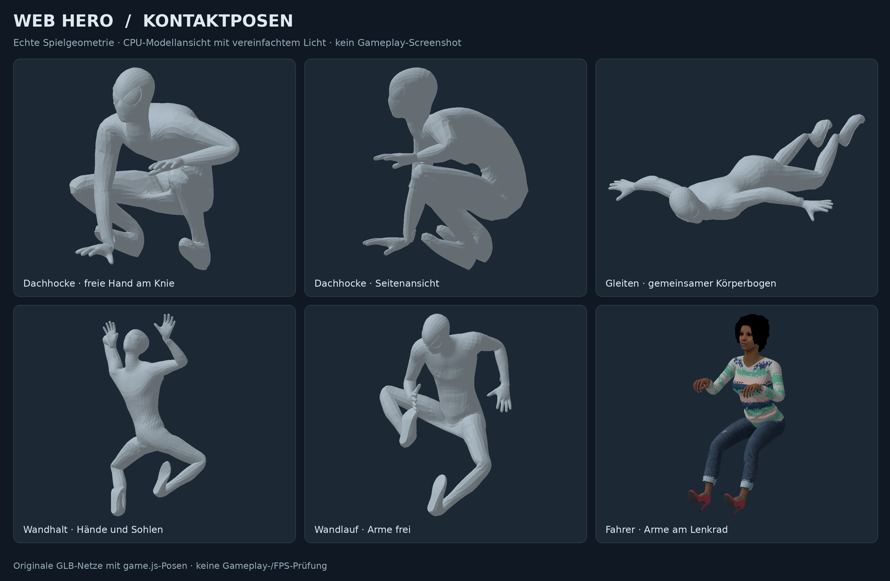

# Spielerfeedback: Posen, Netze, Stadt und Menü

Stand: 5. September 2026. Aufbauend auf `a287054` im separaten Grafik-/Animationsbranch.
Claudes Phase 12.1 (`28a5a232779e1018329cfb8570b656cc8313f96c`) bleibt enthalten.

## Änderungen

| Gemeldeter Punkt | Umsetzung |
| --- | --- |
| Hände und Füße im Wandstillstand | Zweigliedrige Zielkinematik mit festen Ellbogen-/Knierichtungen. Handflächen und Sohlen orientieren sich an der Wand. Die Kontakte werden nach der Körperplatzierung gesetzt. Auch der ruhige Hängezustand bleibt auf diesem Pfad. |
| Dachhocke | Tiefe, asymmetrische Pose mit einem höheren Knie, einer stützenden Hand und einer Hand am Knie. Fuß- und Fingerauflagen führen den Bodenausgleich. |
| Erste Schritte nach der Hocke | Der Duck-Einmalclip beim Loslaufen entfällt. Die Hocke blendet aus, während die Laufbewegung bereits übernimmt; der Bodenausgleich reagiert in diesem Übergang schneller. |
| Gleitkörper | Becken, Wirbelsäule, beide Beine und Arme werden gemeinsam in eine Fluglage ausgerichtet. Die Schultern werden vor der seitlichen Reichweite korrigiert. |
| T-Pose bei Fahrern | Hände greifen nach vorn; Knie und Ellbogen beugen sich. Die Korrektur funktioniert auf allen fünf vorhandenen Zivilistenrigs. PKW und Lkw nutzen den Fahrerpool; im Bus gehört der erste Poolplatz dem Fahrer. Die bereits sitzende vereinfachte Helibesatzung bleibt erhalten. |
| Wechselnde Zug-Skins | Ein Sitzplatz gehört zu einer festen Figurenidentität. Eine andere Entfernungssortierung tauscht die Personen nicht mehr aus. Reservierte Plätze bleiben ausgeschlossen, der Pool bleibt begrenzt. Auch Autofahrer behalten ihre aktuelle Zuweisung, solange sie in Reichweite ist. |
| Wandlauf | Aufrechter Laufclip mit eigener Körperausrichtung, freien Armen und Sohlenkontakt. Shift mit W, A oder D löst an der Wand einen Laufimpuls aus. Vorhandene Höhen-/Ecken-/Kollisionslogik bleibt maßgeblich. |
| Schwungpose | Deutlicheres Anziehen unter Last, kleinere unruhige Folgebewegungen und ein weicher Wechsel des führenden Beins. Arme und Beine haben eine gemeinsame maximale lokale Winkelgeschwindigkeit. |
| Netzoptik | Dünnerer geflochtener Querschnitt, feinere Unterteilung, Schwerkraftdurchhang und gleichmäßig skalierende Textur. Straffe Netze hängen kaum durch. Der Hauptfaden beginnt am Handgelenk; beim Zweihandgriff verbindet ein kurzer Zweig die zweite Hand. Die gemeinsame Darstellung gilt auch für Netzschüsse und Ziehen. |
| Heli als Anker | Ab 28 m über Straßenniveau kann ein anvisierter Heli innerhalb von 80 m gewählt werden. Befestigung unter dem Rumpf an der Kufe. Position und Drehung bewegen den Anker; die Seilbedingung arbeitet mit relativer Geschwindigkeit. Die Helis werden vor dem Spieler aktualisiert. Versperrte Sicht, verlorener Heli oder ein großer Positionssprung lösen die Verbindung. Die Zugbewegung wird gegen Hindernisse geprüft. |
| Zu viel Glas | Breitere Steinpfeiler und Geschossbänder, eine Backstein-/Kupfervariante und stärker gegliederte Silberfassaden. Die Glasvariante bleibt als Bürohochhaus erhalten. Die verbleibenden Fenster zeigen weiterhin zurückgesetzte Räume. Grundfläche, geschlossene Gebäudekollision und Dachhöhe bleiben erhalten. |
| U-Bahn und B-Ebene | Bodenmuster auf vorhandenen Flächen, gekachelte Bahnsteigwände, farbige Bänder sowie lesbare Stations-, Eingangs-, Laden- und Wegweiserschilder. Keine neuen Hindernisse in Treppen, Durchgängen oder Gleisen. Schilder haben eine Entfernungsstufe; unterirdische Details werden oberirdisch ausgeblendet. |
| Gleiche Gegner | Zwei zusätzliche Rollen mit vorhandenen realen Figurenmodellen: Duellant (Blocken/Ausweichen) und Stürmer (hohes Lauftempo/Aggression). Eigene Ausstattung und bestehende Kampfanimationen. Kein zweites KI-/Kampfsystem. Die bisherigen Typwerte und ENFORCER-Werte werden nicht erhöht. Die zufällige Weltgegner-Mischung ändert sich beabsichtigt. |
| Menü und fehlende Desktop-Einstellungen | Gemeinsames Hauptmenü mit sichtbaren Schaltflächen für Steuerung, Einstellungen und Fortschritt. Vier Steuerungsbereiche statt einer Textwand. Beschriftete Kamera-/Grafikfelder, Tastaturfokus und Escape-Rückweg. Untermenüs pausieren auch die Touch-Simulation. Die bisherigen Einstellungen werden weiterhin gespeichert. |

## Prüfung

68 gezielte Tests bestehen. Davon sind 29 für dieses Feedback neu:
fünf Fahrerrigs, Hocke/Loslaufen/Gleiten, vier Wandseiten, drei Wandlaufrichtungen,
feste Sitzzuordnung, Heli-Auswahl und Verlust, bewegte Seilbedingung,
20 Sekunden bewegtes Pendel, Netzgeometrie, Stationsflächen und neue Gegnerrigs
sowie sechs DOM-/Eingabe-/Einstellungstests.

Die vorherigen 39 Prüfungen bleiben grün: unter anderem Kamera vor Fassaden,
Nachbarhaus und Vorsprung, Fenster-Raumtiefe und Dach-/Fahrzeuggrenzen,
Zugtüren/-lichter, unverdeckte Treffer sowie Nahkampf ohne Wanddurchgriff.
Die Schwungmessungen bei 30/60/120 simulierten Hz bleiben innerhalb von
20°/10°/5° maximaler lokaler Gelenkänderung je Schritt.

```sh
# Einmalig für die DOM-Prüfungen: npm install --prefix tools
node --check game.js
node --check city-visuals.js
node --check menu.js
node --test tools/test-animation-polish.cjs tools/test-city-polish.cjs tools/test-realism-polish.cjs tools/test-feedback-polish.cjs tools/test-menu-polish.cjs
git diff --check
```

Die Posen wurden außerdem an den tatsächlich geskinnten GLB-Netzen mit einer
CPU-Modellansicht kontrolliert. Der Held ist darin absichtlich neutral eingefärbt,
damit Form und Kontakte sichtbar sind; sein Spielkostüm wird dadurch nicht geändert.



## Grenzen und nächster Spieltest

Das sind gezielte Funktions-, Geometrie-, Skelett- und DOM-Prüfungen, kein
bestandener vollständiger Browser-Spieltest. Der verfügbare Browser konnte im
bisherigen Versuch keinen WebGL-Kontext erzeugen; diese statische Testseite hat
keinen kompatiblen lokalen Browser-Vorschauserver. Die Menüprüfung erfolgte daher
mit dem tatsächlichen HTML und JavaScript in einer DOM-Testumgebung.

GPU-Bildrate, Textur-/Transparenzsortierung, das Gefühl der Posenübergänge,
die Stationen im laufenden Spiel und die neue Gegner-Mischung brauchen einen
echten Durchlauf. Mehr Fassadendetails und Schilder sowie die veränderte Auswahl
der vorhandenen Figuren können die Leistung beeinflussen. Pools bleiben begrenzt;
es gibt keine neuen Laufzeitbibliotheken oder herunterzuladenden 3D-Modelle.
Netzfäden haben 448 statt 168 Dreiecke je Stück und einen zusätzlichen festen
Faden für den Zweihandgriff. Daraus wird keine Aussage über Spiel-FPS abgeleitet.

Story-Save, Checkpoint-System und Boss-Lifecycle wurden in diesem Durchgang
nicht neu geschrieben. Claudes vollständige Save-/Restart-/Akt-1-Suiten wurden
hier nicht erneut durchgeführt. Ihre früheren Ergebnisse werden nicht als
Nachweis für diesen neuen Stand ausgegeben. Akt 2 wird nicht begonnen.

Empfohlene Reihenfolge im Test:

1. Esc → Einstellungen: Kamera-Folge und Grafik wählen; Steuerung und Fortschritt öffnen und schließen.
2. An einer Wand stillhalten, dann Shift+W und Shift+A/D; über die Dachkante steigen.
3. An der Dachkante hocken, loslaufen, springen, gleiten und mehrfach die Netzhand wechseln.
4. Hoch steigen, einen Heli ins Fadenkreuz nehmen und die Schwungtaste halten; mitfliegen und loslassen.
5. Fahrer von PKW, Lkw und Bus ansehen. Im Zug an denselben Sitzen vorbeigehen und zurückkehren.
6. Stationen und neue Fassaden ansehen; Duellant und Stürmer in einem Weltkampf ausprobieren.

Für diese Änderungen wurden keine Higgsfield-Generierungen beauftragt oder
Credits verbraucht. Es handelt sich um direkt spielbare Geometrie und Code.
