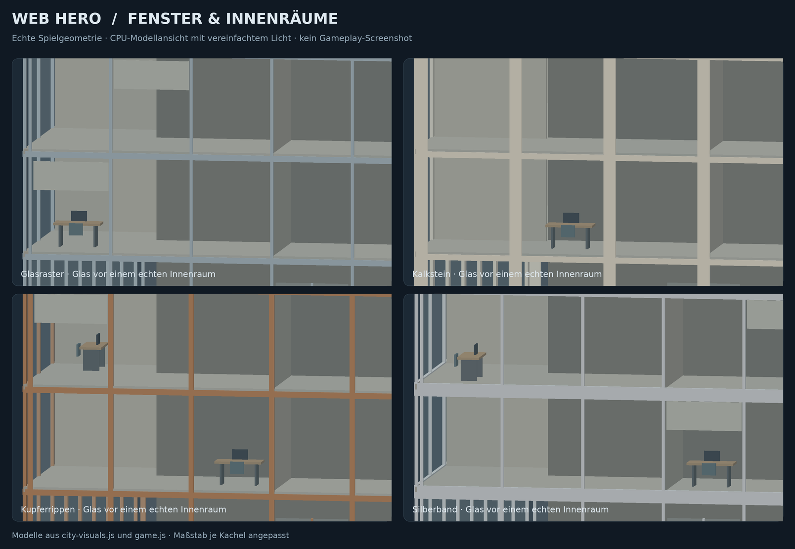
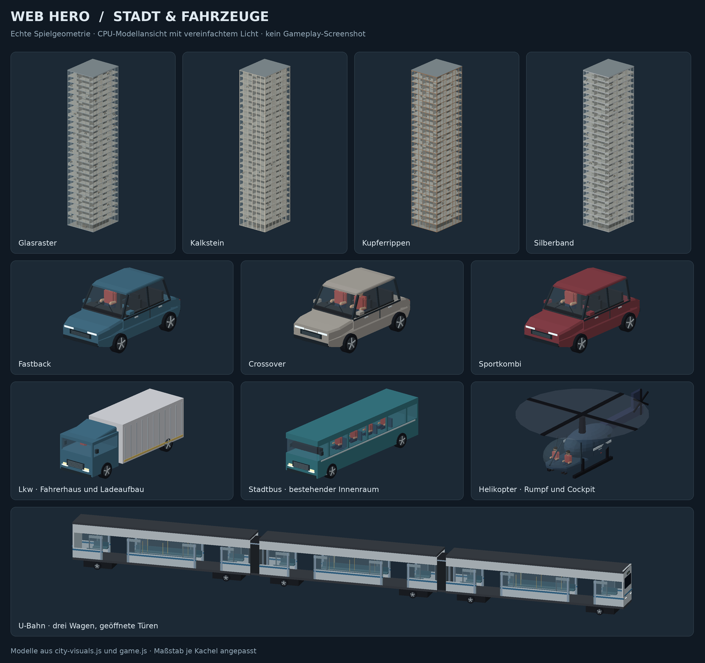

# Glas, Kletterkamera und Kontakt – 5. September 2026

Dieser Durchgang setzt auf `f650be871db498858abecf8eec153ace2ab1e714`
aus PR #1 auf. Claudes Phase 12.1 bis
`28a5a232779e1018329cfb8570b656cc8313f96c` bleibt enthalten.
Der Bauhinweis in der Spielhilfe lautet jetzt
`2026-09-05 / Glas, Kletterkamera und Kontakt`.

## Sichtbare Änderungen

| Bereich | Ergebnis |
| --- | --- |
| Hochhäuser | Durchsichtige Scheiben vor 2,5–3,6 m tiefen Räumen bei den geprüften Hausgrößen. Echte Geschossdecken, Zwischenwände, einzelne Schreibtische, Stühle, Monitore, Rollos und Deckenleuchten. Der undurchsichtige Kern liegt zurückgesetzt. |
| Kletterkamera | Wandnormalen bestimmen bei verdeckter Sicht eine freie Kameraseite. Der Zielabstand beträgt beim Klettern 6,4 m, soweit der Platz es erlaubt. Auch Nachbarhäuser und Vorsprünge werden berücksichtigt. |
| Autos und Lkw | Abgeschrägte Karosseriekanten und Dachverkleidungen. Autos erhalten Scheibenwischer; Crossover und Kombi Dachleisten. Vorherige Rad-, Bremslicht- und Innenraumdetails bleiben enthalten. |
| Fahrzeugkontakt | Die Kollisionsbox berücksichtigt die tatsächliche Fahrzeugdrehung und Welthöhe. Das PKW-Dach liegt auf 1,98 m statt der alten Kollisionshöhe von 1,32 m; Bus und Lkw verwenden ihre jeweiligen Modelldächer. |
| Helikopter | Weitere Türfugen und Lüftungsdetails am vorhandenen Cockpit/Rumpf. |
| U-Bahn | Räder folgen der tatsächlich gefahrenen Strecke. Weiße Stirn- und rote Schlusslichter wechseln mit der Fahrtrichtung, auch bei einem Richtungswechsel im Stillstand. |
| Zivilisten und Gegner | Taschen, Rucksäcke und ausgewählte Rüstungsteile erhalten abgeschrägte Kanten. Die bestehenden Rollen und ihre Ausstattung bleiben angebunden. |
| Trefferanimation | Richtungs- und stärkegesteuerte Oberkörperreaktion. Am Anfang und Ende wird das Rig nicht mehr auf Euler-Nullwerte gezogen. Die visuelle Trefferzeit läuft auch während des Taumelns weiter. |
| Nahkampf | Zielwahl und normale Nahkampftreffer prüfen freie Sicht. Der kurze Ausfallschritt wird gegen vorhandene Welt- und Fahrzeugboxen geprüft, damit er nicht durch dünne Hindernisse springt. |

Die Glasfassaden bleiben geschlossene, bekletterbare Oberflächen. Sichtbare
Innenräume sind in diesem Durchgang nicht betretbar. Die Dachhöhe und der
ursprüngliche Grundriss bleiben erhalten. Fahrzeugkollisionen verwenden
weiterhin konservative, achsenparallele Boxen; dies ist keine neue
Kollisionserkennung für jede einzelne Motorhaube, Dachlampe oder Rotorfläche.

## Warum die Kamera so nah blieb

Beim Klettern kann der Abstand der Figur zur Wand 0,18 m betragen, der
Kameraradius ist jedoch 0,30 m. Dadurch startete die alte Kameraprüfung bereits
innerhalb der erweiterten Wandbox. Zusätzlich zeigte die gewünschte
Kamerarichtung teilweise ins Haus. Eine reine Abstandskürzung konnte diesen
Zustand nicht auflösen.

Der Blickanker liegt nun vor der erweiterten Wand. Nur bei verdeckter Sicht
werden mehrere Richtungen geprüft und eine freie Ansicht gewählt. Die Prüfung
nach Glättung und Kamerawackeln bleibt erhalten. Die Kamera darf in einer
engen Gasse näher kommen, um nicht in das Nachbarhaus zu geraten.

## Modellansichten





Beide Bilder stammen aus den echten Modellfunktionen mit CPU-Tiefenpuffer und
vereinfachtem Licht. Sie sind keine Gameplay-Screenshots; insbesondere
Glanz, Schatten und Haut-/Körperanimationen werden damit nicht vollständig
beurteilt. Für diesen Durchgang wurden keine Higgsfield-Generierungen
beauftragt. Die Änderungen sind direkt verwendbare Spielgeometrie und Code.

## Prüfung

```sh
node --check game.js
node --check city-visuals.js
node --test tools/test-animation-polish.cjs tools/test-city-polish.cjs tools/test-realism-polish.cjs
git diff --check
```

39 gezielte Tests bestanden. Die zwölf neuen Prüfungen umfassen:

- Kletterkamera an allen vier Fassadenseiten, einschließlich der vorher
  fehlschlagenden Ausgangslage mit Kamera im erweiterten Wandbereich.
- Nachbarhaus und dünnen Vorsprung in einer 3,2 m breiten Gasse.
- Tatsächliche Raumtiefe hinter Glas, unveränderte Dachhöhe und geschlossene
  Weltkollision sowie die entfernungsgesteuerte Sichtbarkeit der Möbel.
- Modell-/Kollisionsgrenzen für PKW, Lkw und Bus bei vier Drehwinkeln und
  verschobenem Fahrzeugniveau.
- Zuglichter beim Richtungswechsel ohne Bewegung der Räder.
- Trefferpose an den Endpunkten sowie Stärke und Richtung der Reaktion.
- Einen Nahkampfgegner hinter einer dünnen geschlossenen Wand.
- Den Ausfallschritt vor niedrigen Hindernissen und einem geparkten Fahrzeug.
- Unveränderten Schaden, Kombofortschritt und maximalen Ausfallschritt für
  einen freien Faustschlag.

Die 27 bestehenden gezielten Tests bleiben grün, darunter die Schwungsequenz
bei 30, 60 und 120 simulierten Hz. Die maximale lokale Gelenkänderung beträgt
dabei weiterhin 20°, 10° beziehungsweise 5° pro Schritt. Diese Werte sind
Skelettmessungen, keine gemessenen Spiel-FPS.

Missionen, Story-Save, Checkpoints, Progression, Bosswerte und Bossphasen
werden nicht neu geschrieben. Der bereits korrigierte Bossphasen-Aufruf
während des Taumelns bleibt bestehen. Schaden, Reichweite und Gegnerwerte
bleiben gleich; die neue Sichtprüfung ist eine beabsichtigte Änderung der
Nahkampf-Zielerreichbarkeit. Act 2 wird nicht begonnen.

## Aufwand und noch offener Spieltest

Echte Räume benötigen mehr Geometrie: Ein 18 × 90 × 22 m großes Haus enthält
je nach Variante 10.352–12.002 Dreiecke, beim Größentest bis 132 m weniger als
19.000. Struktur, Glasscheiben und Leuchten sind jeweils zusammengefasst.
Die Möbel liegen in einer zusätzlichen Detailstufe und werden ab 150 m
Entfernung ausgeblendet. Es werden keine zusätzlichen Laufzeit-Texturen oder
Bibliotheken geladen. Transparenz und die höhere Geometriezahl können die
GPU stärker belasten; die Bildrate der gesamten Stadt muss im Spiel geprüft
werden.

Der verfügbare Browser konnte keinen WebGL-Kontext erzeugen. Deshalb stehen
der vollständige Spieltest, das Kameragefühl beim Wechsel auf die Dachkante,
Transparenzsortierung im GPU-Renderer, GPU-FPS und der menschliche
Act-1-Durchlauf noch aus. Die gezielten Tests ersetzen weder Claudes gesamte
Kampagnenregression noch den Human-Play-Gate.

Für den nächsten Durchlauf:

1. An allen Hausseiten hochklettern, die Kamera drehen und über die Dachkante
   steigen; dabei die Figur und die benachbarten Fassaden beobachten.
2. Nah an den Fenstern vorbeischwingen, auf dem Dach landen und prüfen, ob
   die Sichtbarkeit der Innenräume und die Bildrate passen.
3. Auf Auto-, Lkw- und Busdächern landen und bei einer Kurve mitfahren.
4. Einen Gegner neben einer Hauswand oder einem geparkten Auto bekämpfen;
   freie Treffer sollen verbinden, verdeckte Ziele keine Treffer erhalten.
5. Zughalt, Türen und Richtungswechsel sowie den Helikopter im Flug ansehen.

Ansichten reproduzieren (Python 3, Pillow und NumPy erforderlich):

```sh
node tools/render-city-preview.cjs
node tools/render-city-preview.cjs --windows
```

Der GitHub-Pages-Hauptstand wird durch diesen separaten Testbranch nicht
automatisch ersetzt. Die private Testversion erhält denselben geprüften
Laufzeitcode wie PR #1.
