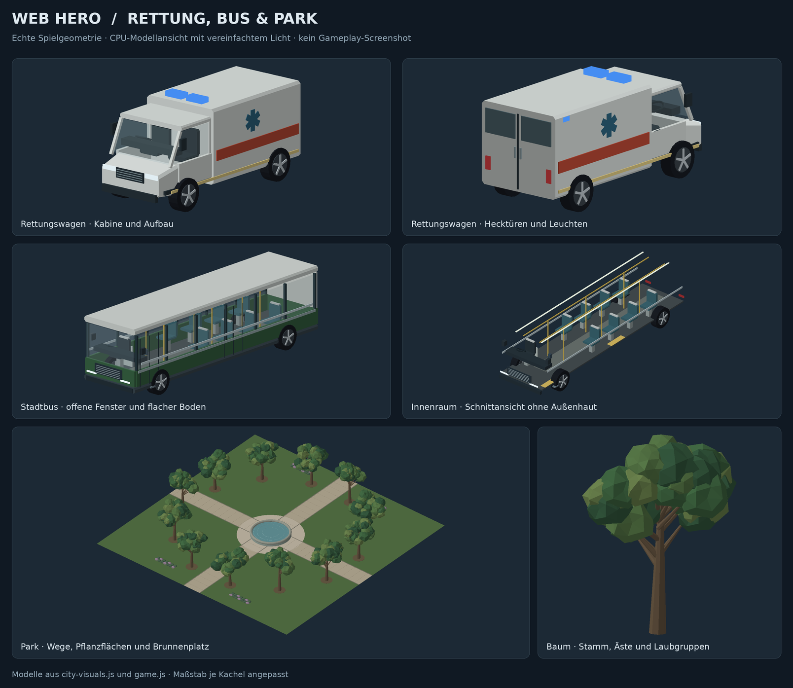
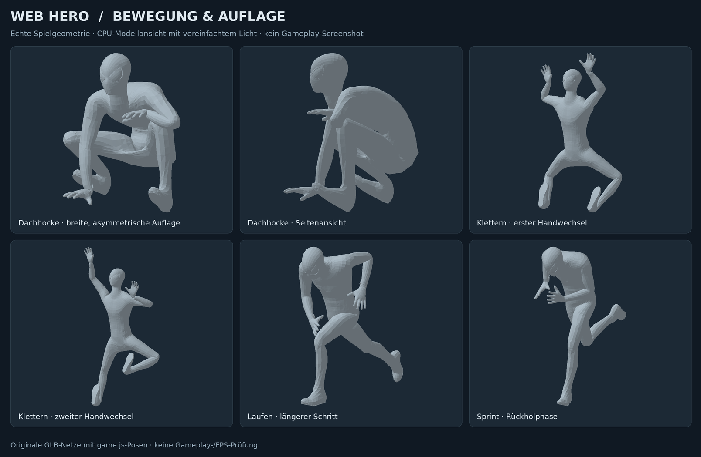

# Zweiter Videodurchgang: Klettern, Fahrzeuge und Park

Stand: 5. September 2026. Aufbauend auf `a3d1fc2` im Branch
`codex/animation-polish-2026-09-04`. Die drei Screenshots und das 63 Sekunden
lange Spielvideo wurden ausgewertet. Besonders auffällig waren die seitlich
abstehenden Beine beim Wandlauf, die breite Kletterbewegung und die im
Busaufbau verschwindenden Unterkörper.

## Korrekturen

| Bereich | Änderung und Ursache |
| --- | --- |
| Klettern und Wandlauf | Die Wandlauf-Ziele verwendeten bei negativen Wandnormalen die rohe Fassadenkoordinate mit falschem Vorzeichen. Tests an der Nullebene hatten diesen Fehler verdeckt. Die Berechnung verwendet jetzt die orientierte Wandebene. Beim normalen Klettern übernimmt ein gemeinsamer Kontaktzyklus Hände und Füße nach der endgültigen Körperplatzierung. Die aufrechte Grundpose verhindert den Konflikt mit dem vorherigen liegenden Clip. Tempo, Richtungswechsel und Stillstand steuern den Zyklus. |
| Dachhocke | Breiterer Stand, gestaffelte Füße, asymmetrische Knie, eine stützende Hand und ein höherer freier Arm. Die schmale Variante bleibt für enge Auflagen erhalten. Der bestehende Übergang zum Laufen bleibt weich. |
| Gehen, Laufen und Rennen | Der längere vorhandene Laufclip wird früher gewählt. Seine Abspielgeschwindigkeit ist begrenzt. Standfüße erhalten eine weich ausblendende Korrektur in Weltkoordinaten, mit Reichweitengrenze und Freigabe bei Sprung, Kampf, Klettern und bewegten Plattformen. Das ist keine Zusage vollständig schlupffreier Schritte. |
| Rettungswagen | Neue native Geometrie mit schräger Windschutzscheibe, hohler Fahrerkabine, Sitz/Lenkrad, gegliedertem Patientenaufbau, Hecktüren, Spiegeln, Leuchten, Grill und Beschriftung. Blinklicht-, Fahrer- und Radreferenzen bleiben an den bestehenden Fahrzeugablauf angeschlossen. Die Kollisionshülle umfasst die sichtbare Karosserie samt Dach. |
| Bus | Der frühere massive Unterkörper reichte bis in den Sitzraum. Jetzt bestehen Boden und Seiten aus getrennten dünnen Flächen. Freier Mittelgang, richtige Sitzhöhen, Haltestangen, Deckenleuchten, Fahrerplatz und ruhigere Farben. Sitzende Figuren werden auf allen fünf vorhandenen Zivilistenrigs korrigiert; Beine verschwinden nicht mehr im alten Karosserieblock. |
| Bäume und Park | Vier wiederverwendete Baumformen mit verjüngten Stämmen, Ästen und unregelmäßigen Laubgruppen. Neue Pflanzflächen, gepflasterte Wege und Brunnenplatz; vorhandene Rasenstruktur bleibt erhalten. Baumstämme und Brunnen erhalten passende feste Kollisionskörper. Wegkreuz und Zugänge bleiben frei. |

## Prüfung

**83 gezielte Tests bestanden, 0 fehlgeschlagen.** Die 68 bisherigen Prüfungen
bleiben enthalten; 15 neue decken das Videofeedback ab. Die Tests verwenden jetzt
auch dieselbe GLB-Größennormalisierung wie der tatsächliche Spiellader statt
einer allein aus den Knochen geschätzten Größe.

Geprüft wurden verschobene Fassaden in allen vier Richtungen, mehrsekündiges
Klettern mit Stillstand und Richtungswechsel, beide Hockvarianten, Gangarten bei
2/7/11 m/s, Rettungswagen-Grenzen bei mehreren Drehwinkeln, Bus-Beinfreiheit und
Sitzhöhen sowie geteilte Baumgeometrie und freie Parkwege. Die Laufkorrektur darf
keinen größeren abrupten Fußsprung als der vorhandene Clip selbst hinzufügen.
Syntaxprüfung und `git diff --check` sind sauber.

```sh
# Für die DOM-Prüfungen zuerst die Werkzeuge installieren:
npm install --prefix tools
node --test tools/test-animation-polish.cjs tools/test-city-polish.cjs tools/test-realism-polish.cjs tools/test-feedback-polish.cjs tools/test-menu-polish.cjs tools/test-video-feedback.cjs
node --check game.js
node --check city-visuals.js
node tools/render-city-preview.cjs --life
```

Die folgenden Bilder zeigen reale Spielgeometrie, mit vereinfachtem CPU-Licht.
Sie sind keine Gameplay-Screenshots. In der Bewegungsansicht ist der Held neutral
eingefärbt, um Form und Kontakte zu prüfen; sein Spielkostüm bleibt erhalten.
Die Modellansicht bildet browserseitige Texturen und Beschriftung nicht vollständig ab.





## Offene Prüfung im Spiel

Ein vollständiger Browser-Spieltest und GPU-Leistungsmessungen stehen aus:
Der verfügbare Browser konnte keinen WebGL-Kontext erzeugen. Die numerischen
Tests und Modellansichten ersetzen weder das Bewegungsgefühl noch einen
Kamera- und Transparenztest im laufenden Spiel. Zusätzliche Baumgeometrie muss
auf dem tatsächlichen Gerät auf Bildrate geprüft werden.

Claudes vollständige Akt-1-, Save- und Restart-Suiten wurden in diesem Durchgang
nicht erneut ausgeführt. Missions-, Checkpoint- und Boss-Systeme wurden nicht
umgebaut. Aus den Prüfungen folgt keine Aussage über die Kampagnenlänge oder
eine fehlerfreie gesamte Spielwelt.

Für den nächsten Durchlauf: an verschiedenen Hausseiten hoch, herunter und
seitlich klettern, stoppen und mit Shift in den Wandlauf wechseln; danach über
die Dachkante steigen, hocken und losrennen. Bus und Rettungswagen aus der Nähe
betrachten und durch den Park gehen, besonders an Stämmen und Brunnen vorbei.

Für diesen Durchgang wurden keine Higgsfield-Credits verbraucht und keine neuen
Laufzeitbibliotheken oder externen 3D-Modelle hinzugefügt.
