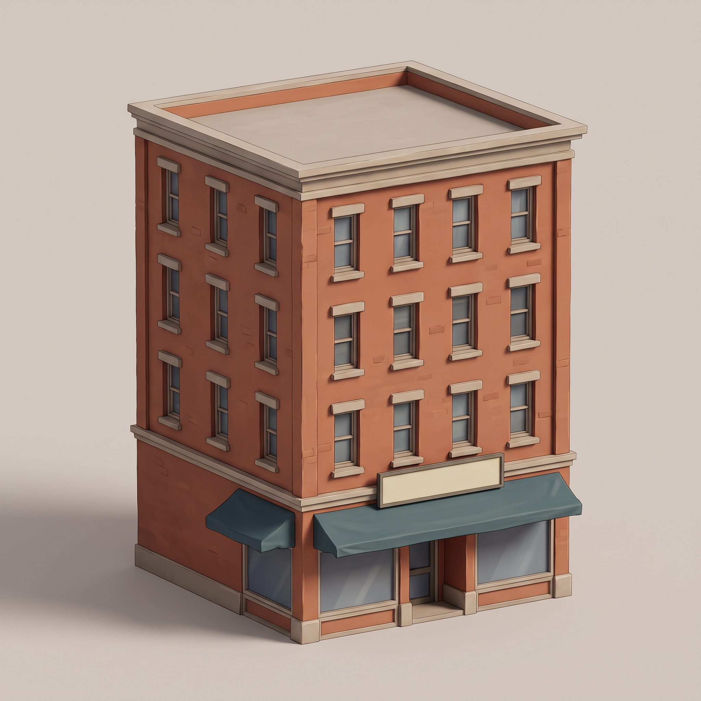
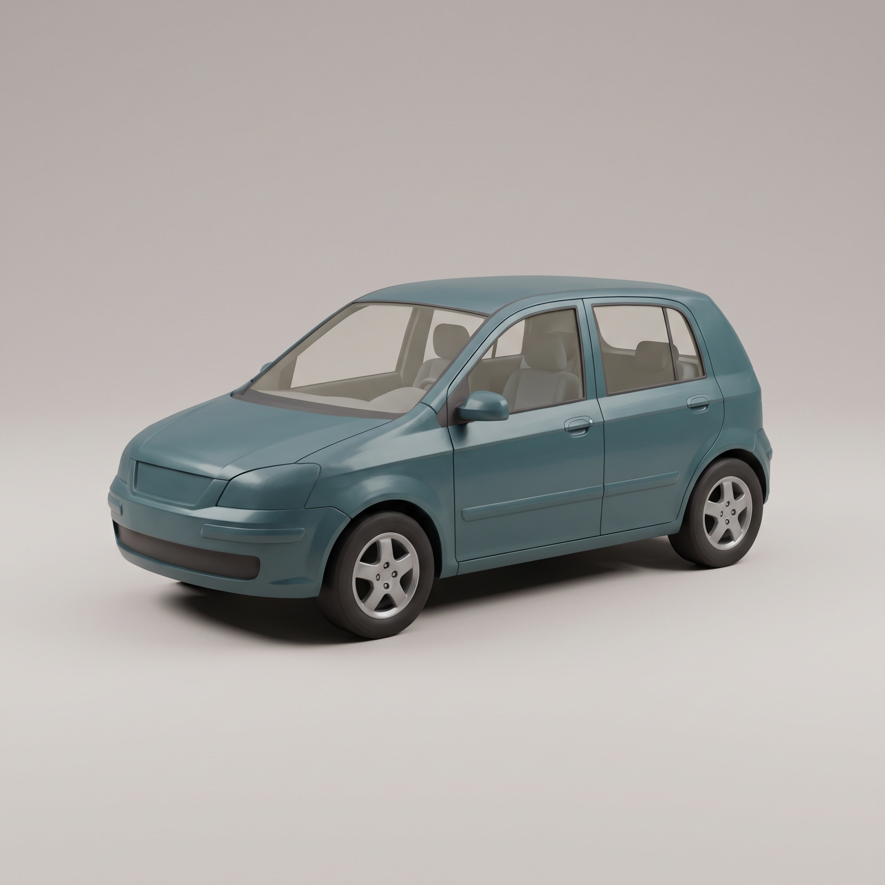

# WEB HERO – erste Umgebungsentwürfe

**Stand: 4. September 2026. Zwei Referenzbilder, noch keine 3D-Spielmodelle.**

Diese Probe legt einen gemeinsamen Stil für Gebäude und Alltagsfahrzeuge fest: warme Backsteinfassaden, zurückhaltende Details und ein gedecktes Petrol als Farbakzent. Die Bilder wurden über den verbundenen Higgsfield-Zugang erzeugt und visuell geprüft.

| Gebäude | Stadtwagen |
| --- | --- |
|  |  |

## Was vorliegt

- Zwei originale PNG-Dateien mit jeweils 2048 × 2048 Pixeln.
- Die vollständigen Generierungsparameter und Auftrags-IDs in [generation.json](generation.json).
- Konkrete Vorgaben für die anschließende Modellierung in [MODEL-BRIEF.md](MODEL-BRIEF.md).

Das Gebäude besitzt im Ergebnis einen Laden und drei Wohngeschosse. Der Prompt hatte fünf Gesamtgeschosse verlangt; für diese freie Stilprobe werden die sichtbaren vier akzeptiert. Die Fahrzeugsilhouette, Fenster und Radpositionen sind eine Vorlage. Ein Bild belegt keine korrekte Rückseite, Innengeometrie oder getrennte Räder.

## Kosten und Werkzeugstatus

Higgsfield veranschlagte für die zwei Bilder insgesamt **4 Credits**. Eine tatsächlich verbuchte Abbuchung wurde nicht bestätigt. Angefordert wurde `nano_banana_pro`; die abgeschlossenen Aufträge melden `nano_banana_2`. Beide Werte bleiben in der Dokumentation erhalten.

Der Modellkatalog enthält 3D-Angebote. Der dafür erforderliche Befehl `generate_3d` ist jedoch im derzeit verbundenen Werkzeugumfang nicht verfügbar. Es wurde kein 3D-Auftrag gestartet. Diese Bilder dürfen deshalb nicht als fertige GLB-Dateien, Animationen oder bereits eingebaute Verbesserungen bezeichnet werden.

## Abgrenzung zu Phase 12.1

Ausgangspunkt ist Commit `ae7297c0d83b42e78f75b6dda574f5c7a5f9c65a`. Alle Dateien dieser Probe liegen ausschließlich in `experiments/higgsfield-environment/`. Die produktive Spielseite lädt sie nicht.

Diese Probe ändert keine Mission, keinen Spielstand, keine Kollision und keine Fahrzeuglogik. Vor einem Einbau folgen Modellprüfung, Größenabgleich und ein Vergleich im Spiel. Die Arbeit an Act 1 und der menschliche Kampagnentest bleiben davon unabhängig.

